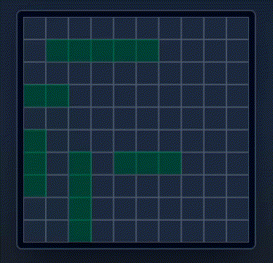

# Battleship (clone)

_A clone of [mattpjohnston](https://github.com/mattpjohnston/battleship)'s app, to practice learning and extending (not refactoring) a codebase._

## New Features

- Drag-and-drop ship positioning, thoroughly polished and tested.
- Ship sunkenness visuals which improves gameplay significantly.
- Epic soundtracks that play in different phases.

